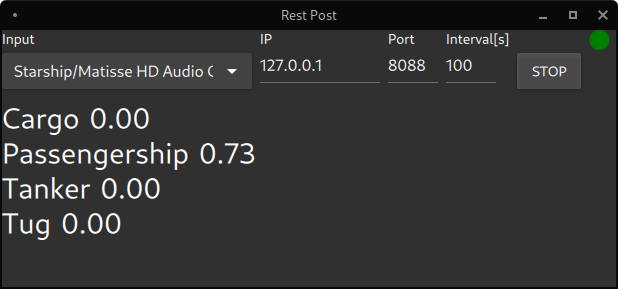

# Using deep learning to classify ships by sound
DAT255 course project at Western Norway University of Applied Sciences.

## Project structure
 - [DeepShip](./DeepShip) - Final project notebook and inference script location
 - [Experiments](./Experiments) - Notebooks with training experiments  
 - [dataset](./dataset) - Datasets used by this project
 - [docker](./docker) - Docker scripts for generating the images and starting jupyterlab
 - [models](./models) - Link to trained models 
 - [RestClinet](./RestClient/) - Rest client written in Qt


## Background
For a background for the project and some considerations, please read [here](Background.md).

## Results
A Resnet50 image classification model, using fastai, is trained on random spectrograms taken on the fly from the [DeepShip](dataset/README.md#1) dataset. 20% of the data is used for validation, and the model achieves validation accuracy of 94%.  
This is a significant improvement from the paper, and as far as I can tell, the state of the art for this dataset. 
  
Further details
 - [notebook](./DeepShip/1.%20deepship_3ch.ipynb) using reguilar STFTs (93,75% accuracy),  
 - [notebook](./Experiments/8.%20deepship_3ch_qct_polar.ipynb) using polar representation of CQT spectrograms (94% accuracy, possbly overfitted)

**Note:** *The DeepShip dataset contains recording of similar ships, though recorded at different points in time, under different conditions. That could be one of the reasons behind a unusual high accuracy score.* 

## Requirements
 - Nvidia GPU with cuda support
 - Linux
    - docker-compose with nvidia container toolkit and runtime
    - [Nvidia setup guide](https://docs.nvidia.com/datacenter/cloud-native/container-toolkit/install-guide.html)

**Note:** *Windows 11 Should work according to [this](https://www.docker.com/blog/wsl-2-gpu-support-for-docker-desktop-on-nvidia-gpus/) blogpost, but I was not able to set it up*

**Note:** *The only system configuration I have tested with is Arch Linux and a RTX3080. It should work on most cuda capable graphics cards, and if something "CUDA out of memory", try reducing batch-size and/ or image size parametes, found in the different notebooks or inference script*

## Setup
This project utilizes `docker-compose` for training and inference.
This makes the whole ML stack portable.  
More details on the docker images is found in the [docker](./docker/) directory.  
Run `docker-compose build fastai` to build the training and inference image.

### Experimentation / Training
Run `docker-compose up fastai` to reach jupyterlab with a webbrowser (open link from the terminal).  
It should be something like this http://127.0.0.1:80/lab?token=45604507b9f4a392...  
With jupyterlab you can run notebooks, and train models.  
  
In order to train, you need a copy of the [DeepShip dataset](https://github.com/irfankamboh/DeepShip). 
Then you need to extract the files to the `dataset/DeepShip` folder.  

### Inference with Rest API
Run `docker-compose up rest` to start the rest api.  
This starts the rest server defined in `DeepShip/rest.py`  
The rest api works by uploading a multipart formdata sound file "file" to port 8088.  
The server processes the file; resamples it if needed, and returns the mean propbabilites for each class in a json format.  
Every filetype torchaudio support, should work with inference.   
  
Example using curl from the command line

```console
curl -F file=@'./hurtigbaat test mono.wav' http://127.0.0.1:8088
```
**Note:** *This test file is recorded with a hydrophone by a pier in Bergen, while a passengership is passing by. It is not used during training.*
```json
{"Cargo":0.0,"Passengership":0.9243250489234924,"Tanker":0.0,"Tug":0.0}
```

If there are any errors processing the file, the server will return a message something like this
```json
{"error":"Something failed"}
```
  
### Client application

  
[Link](./RestClient/)

## Further work / ideas
### Preprocessing
 - Test More signal processing before feeding the networks
 - Extract envelope modulation as its own image layer
 - Apply augementation on audio / spectrograms. 

### Method
- Represent audio differently, using PCA or SVD. 
- Fit random trees or some gradient boosting algorithm (xgboost)
### Models
 - Test more network architectures; recurrent networks, tranformers, and so on.
    - Try those that tests nnAudio https://github.com/KinWaiCheuk/pytorch_template
 - Design a custom model which tranins on features from different fft-sizes separatley.

### Docker
 - Update images, both new versions of ubnutu lts and pytorch are aviable.
 - Merge tensorflow and pytorch images. Both are based on ubuntu, so it should be possible. 